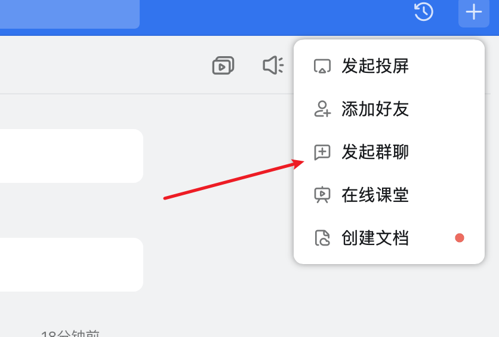
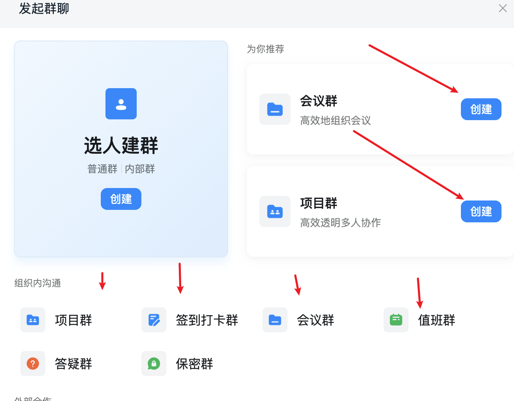
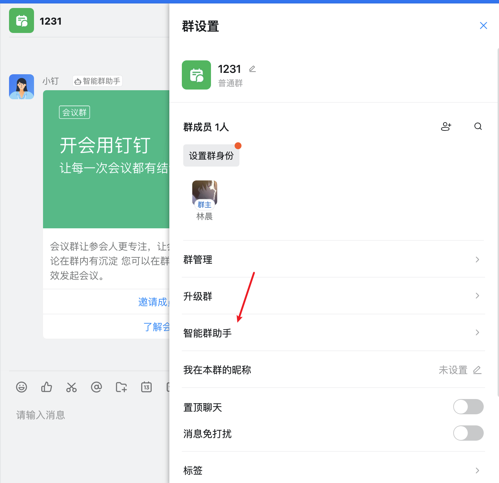
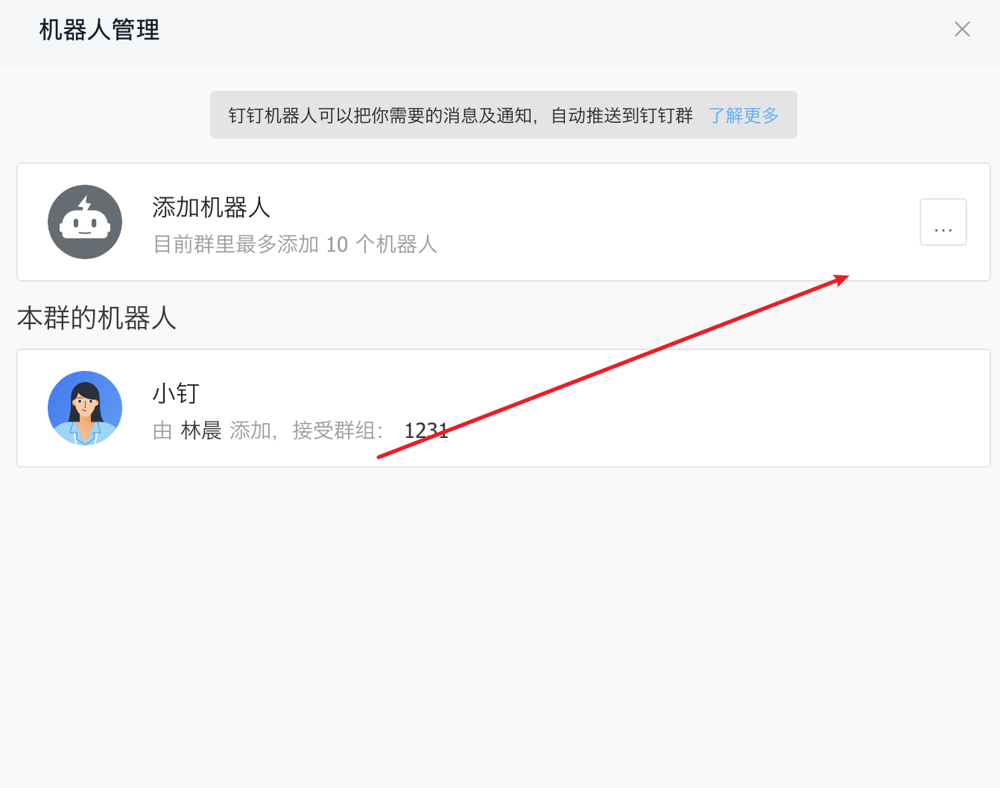
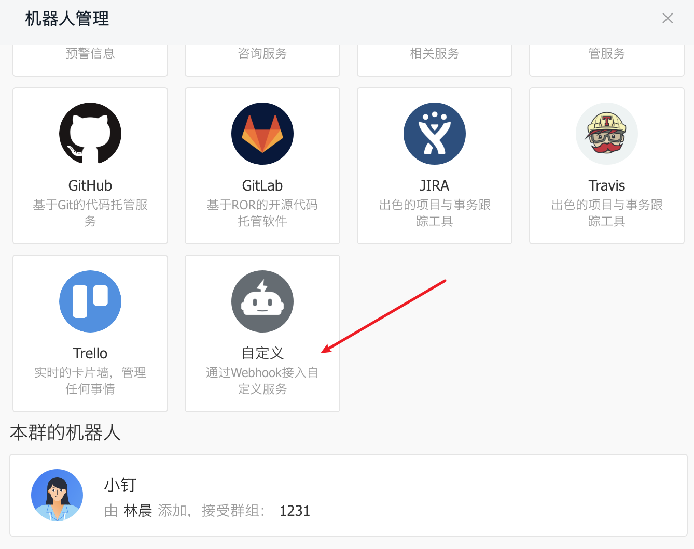
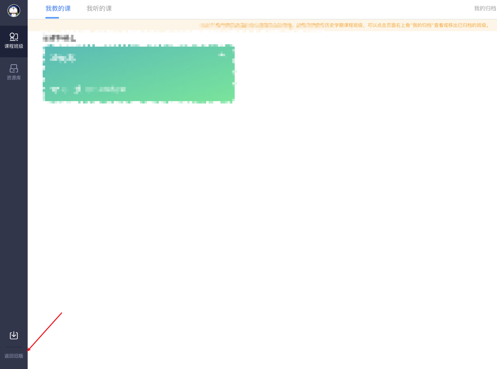
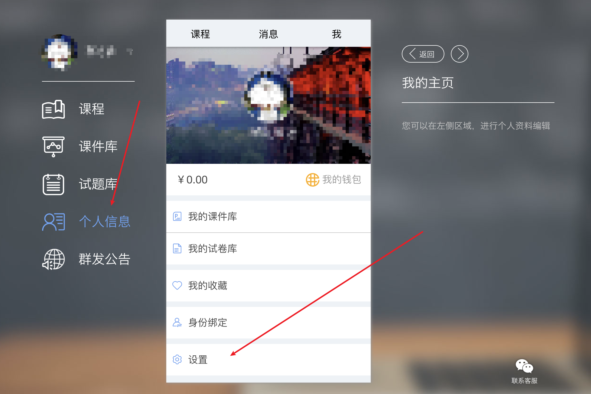
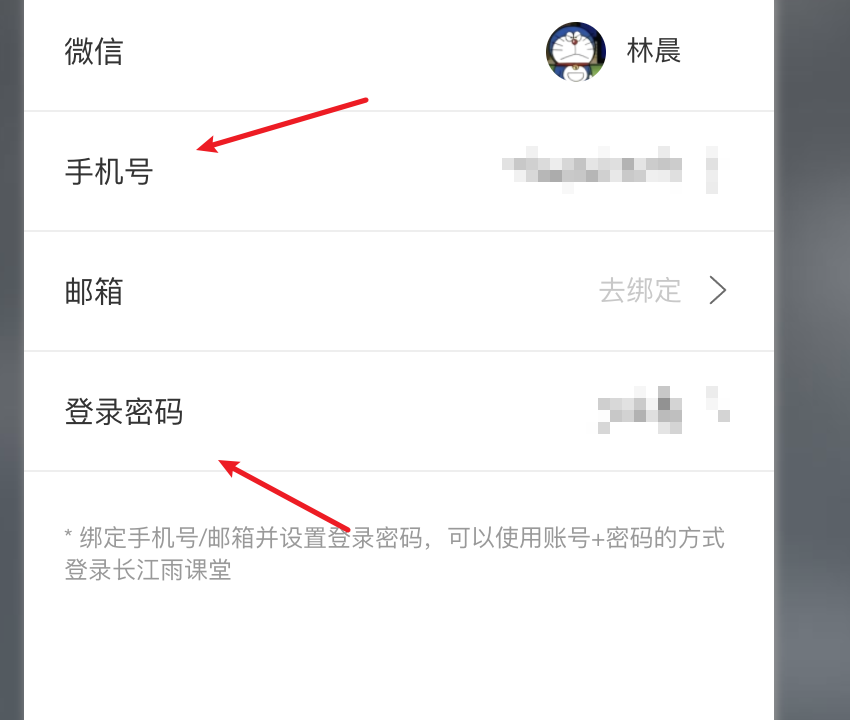

# Usage
### 来自单身男子@[0chencc](https://github.com/0Chencc)的重构，删除原来冗余的代码，更换为requests包来请求。放弃方糖推送改用钉钉推送

## 方法一（不推荐）
```shell
git clone https://github.com/0chencc/AutoAttendYuKeTang
cd AutoAttendYuKeTang
python3 -m venv env
source env/bin/activate
pip install -r requirements
```

## 方法二：利用github的aciton
已在.github/workflows/main.yml设置好默认配置，有需求可以自己研究一下github云函数的命令自己编写新的

1. Fork [this responsitory](https://github.com/0chencc/AutoAttendYuKeTang)
2. 申请[钉钉机器人](#钉钉机器人配置方法)
3. fork项目到自己的github上之后, 点击'Settings' ->  'Secret'
4. 在Secret页面中，配置好自己的雨课堂账号密码以及钉钉机器人的webhook和sign信息，[如何设置雨课堂账号密码](#设置雨课堂账号密码)
   - 'USER_INFO': 雨课堂账号|雨课堂密码
   
     如：13000000000|123456
   
   - 'SECRET': 钉钉机器人的sign
   
   - WEBHOOK:钉钉机器人的webhook


## 钉钉机器人配置方法

在聊天框中发起群聊，选择任意群（除了选人建群）即可创建单人群聊












# 设置雨课堂账号密码

扫码登陆长江雨课堂，按如下图操作即可






设置手机号以及登陆密码，记住这些信息


